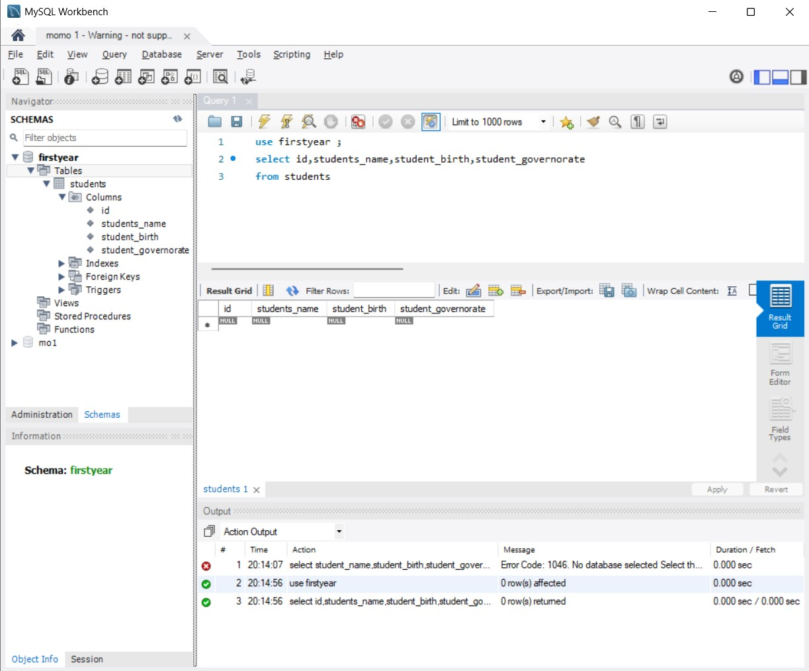

# 🏫 Al-Tamayuz School Database Management System

## 📝 Project Overview
The **Al-Tamayuz School Database Management System** is a fully functional relational database designed to streamline and automate the administrative and academic operations of an educational institution. The project focuses on efficient data storage, complex querying, and performance tracking for students, teachers, and courses.

## 🎯 Problem Statement
Managing school records manually or through simple spreadsheets leads to data redundancy, security risks, and difficulties in tracking academic progress. This project solves these issues by providing a centralized, secure relational database that automates GPA calculations and quickly identifies students requiring academic support.

## 🛠️ Tools & Technologies Used
* **Database Management System (DBMS):** MySQL / MySQL Workbench
* **Language:** SQL (DDL, DML, DQL)
* **Concepts:** Relational Database Design, ERD, Joins, Aggregation, Data Integrity

## ⚙️ Key Features & SQL Implementation
* **Entity-Relationship Modeling:** Designed structured tables for `Students`, `Teachers`, `Subjects`, and `Grades` with proper Primary and Foreign Keys to ensure data integrity.
* **Automated Academic Tracking:** Wrote complex SQL queries to automatically calculate the average GPA for students across multiple subjects.
* **Performance Reporting:** Developed queries to filter and identify "at-risk" students (e.g., those scoring below a certain threshold), providing actionable insights for school administration.
* **Efficient Data Retrieval:** Utilized advanced `JOIN` operations to link teachers with their respective subjects and enrolled students, optimizing database query performance.

## 📸 System Snippet

---
*Developed & Designed by **Mohamed Ahmed Hegazi***